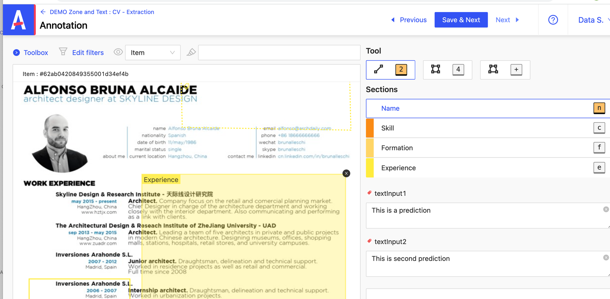
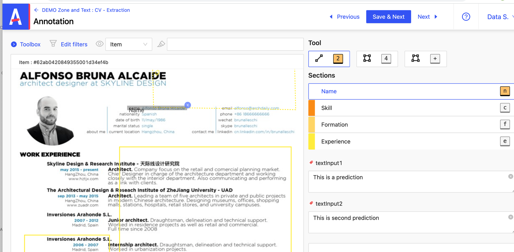
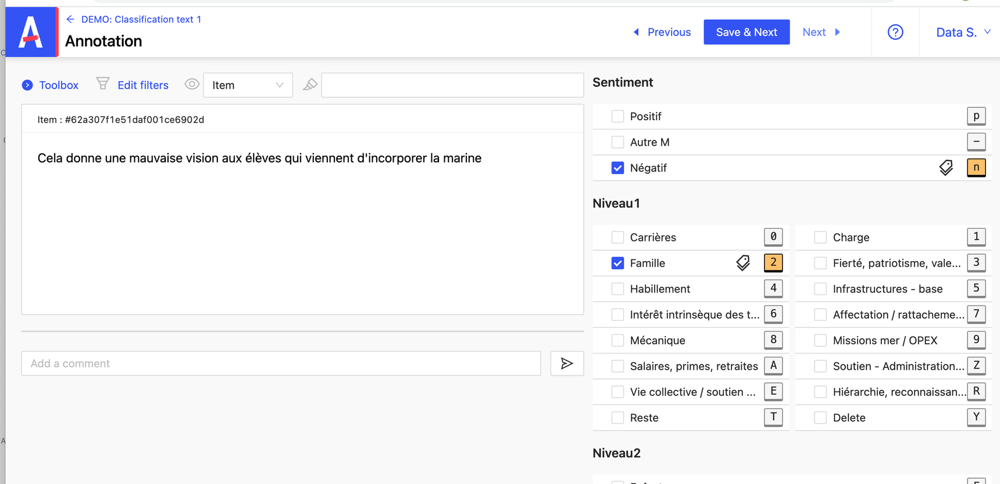

# Type de projets et annottation

Après avoir installé le projet Annotto, vous aurez plusieurs demo a disposition avec différentes typologies d’annotation.

Ci-dessous, nous allons passer en revu ces différents types d’annotation :

## Zone

En cliquant sur le projet « Demo Zone and Text : CV - Extraction », vous avez la possibilité d’annoter sur votre item ( une image ) en localisant des zone et en les labelissant.

Par exemple, sur le screen ci dessous, l’utilisateur a créer un rectangle et a labellisé “Experience” pour localiser sur l’image la partie du CV qui traite de l’expérience professionnel.

Pour effectuer une labellisation, il suffit de : 

- Cliquer sur une “Sections” ( Name, Skill, Formation, Experience)
- Cliquer sur un “ Tool” 
- Puis de cliquer sur l’image et délimiter la zone voulu

Là par exemple, j’ai rajouté la zone “ Name “ : 

Si vous souhaitez supprimer une annotation, il suffit de cliquer sur la croix.

## Classification

En cliquant sur le projet « Demo : Classification text 1», vous avez la possibilité de classer l’item dans certaines catégories

Par exemple, sur le screen ci dessous, l’utilisateur a estimer en lisant le message qu’un sentiment négatif était communiquer et qu’il traitait de “Famille” : 

Pour classer un message selon les catégories, il suffit simplement de cliquer sur la croix à côté de la catégorie voulu.
