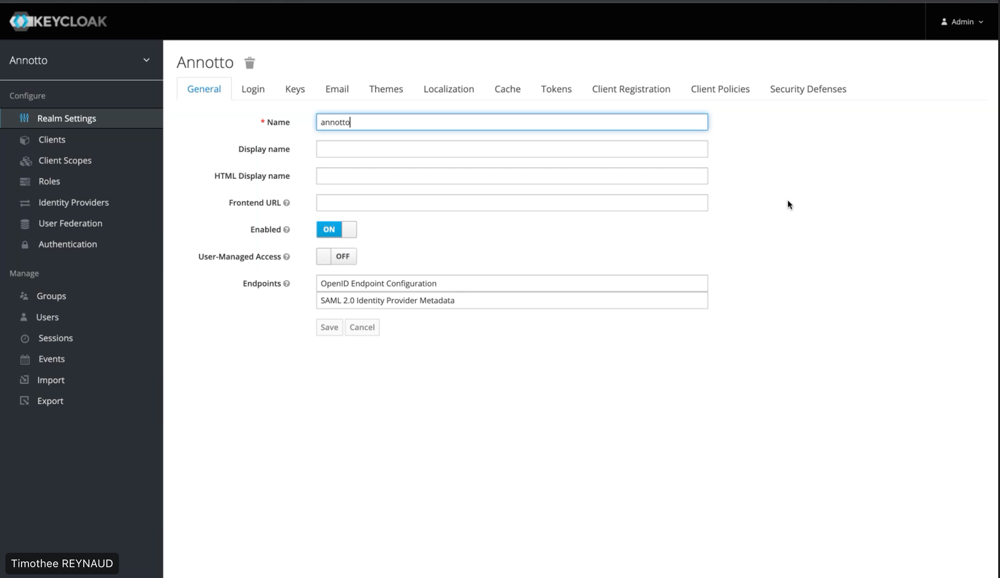
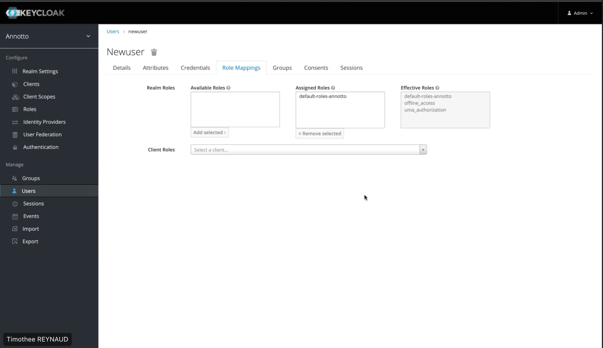
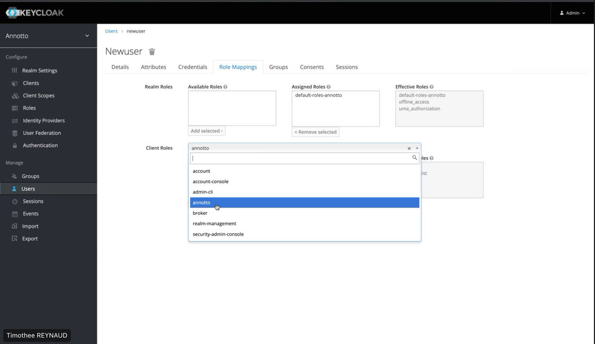

# Création de compte et assignation de rôles

## Création de compte

Pour créer un compte, il est nécessaire de passer par keycloak. Ci-dessous, une description étape par étape pour la création de compte :

1. Se rendre sur la console Keycloak en suivant l’url suivante : http://localhost:8080/auth

2. Cliquer sur “ Administration Console “

3. Se logger avec les logins admin.

On atterrit sur cette page : 

4. Cliquer sur “ Users “ dans la barre latérale. En cliquant sur “ View all users “ vous avez accès à l’ensemble des users existant.

5. Cliquer sur “Add user” en haut à droite

6. Renseigner dans les champs les informations de l’utilisateur que vous souhaitez créer

7. Cliquer sur “Save”

8. Aller ensuite sur l’onglet “Credentials” afin de lui donner un mot de passe temporaire ou non ( en fonction du toggle )

9. Entrer le mot de passe que vous souhaitez lui attrivuer puis cliquer sur “Set Password”

:::note
Votre utilisateur est ainsi crée mais à ce stade, il n’a pas de rôle.
:::

## Assignation de rôles

Après avoir crée utilisateur, il faut lui assigner un rôle. Voici le processus à suivre

1. Se rendre sur l’onglet “RoleMapping” de la page “ Users “ dans keycloak

2. On clique sur “ Client Roles “ afin de retrouver les rôles que l’on peut assigner

3. On choisit le client, par exemple ici on choisit “annotto” 

4. Les rôles disponible pour le client choisit s’affiche dans la partie “ Available roles “

5. Cliquer sur le rôle que vous souhaitez assigner et cliquer sur “ Add selected “

:::info 
IMPORTANT : Il est possible d’attribuer plusieurs rôles. Si vous choisissez d’attribuer plusieurs rôles à l’utilisateur, il aura l’union des droits attribué à chaque rôles
:::
