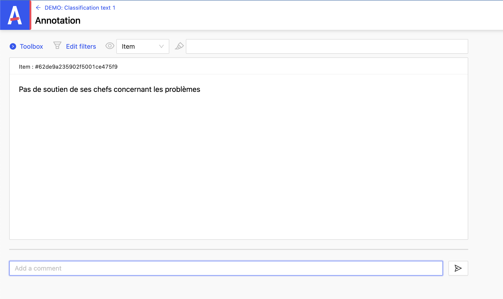
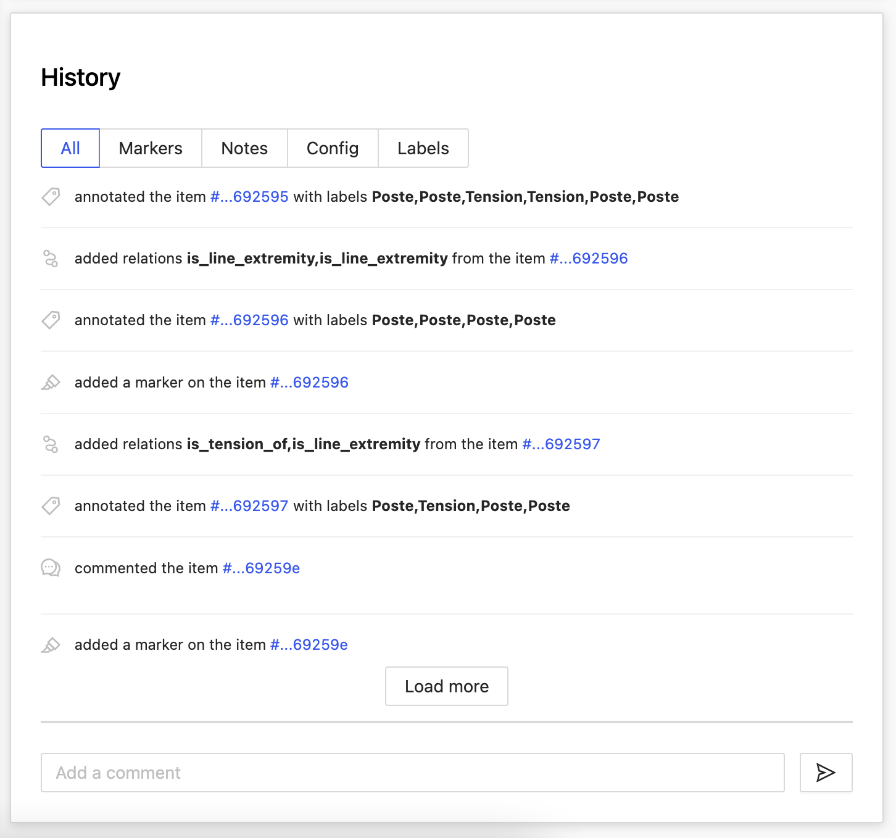

# Add a comment

When annotating an item, you can add a comment via the dedicated field just below.

It is enough:

1. write your comment

2. press enter

- It is also possible to add a comment from the project page.

- The new comment as well as the old ones are visible from the space **_History_**.

You can filter the annotation history by:

- **_Markers_**
- **_Notes_**
- **_Config_**
- **_Labels_**
