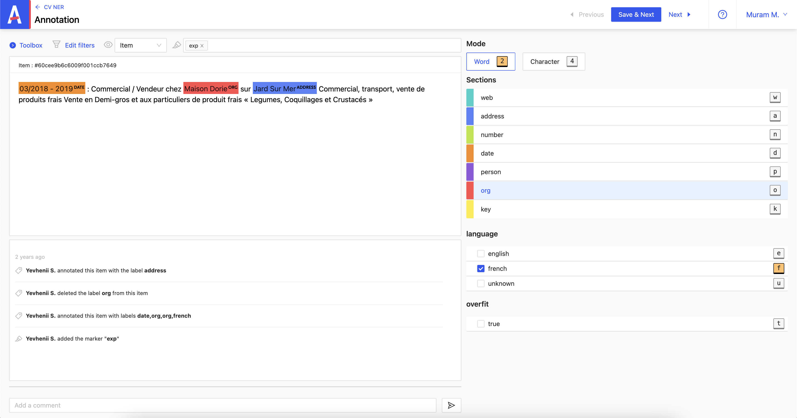

import useBaseUrl from '@docusaurus/useBaseUrl'

# Annotation of a project: NER and Classification

The **DEMO: NER and Classification** project allows you to classify the item by specified categories. The **_NER_** mode includes two selection modes **_Word_** and **_Character_** and the **_Classification_** mode with which the selection is made through a checkbox.

The **_Word_** mode allows you to select a word or a sequence of words.

In the example below, we determine the date, name and address of the organization.

<video src={useBaseUrl('/video/screenrecord-1-7.mov')} controls width="100%"></video>

- Once the annotation is done, you can save it by clicking on **_Save & Next_**.
- To delete an annotation, just click on the X button at the top-right of the selection.

The **_Character_** mode allows you to select one or more character(s).

In the example below, the month is determined.

<video src={useBaseUrl('/video/screenrecord-1-8.mov')} controls width="100%"></video>

- Once the annotation is done, you can save it by clicking on **_Save & Next_**.
- To delete an annotation, just click on the X button at the top-right of the selection.

In addition to the NER, the classification here makes it possible to determine the language of the document. For example, on the recording below, the user has estimated by reading the message that the language used is french.

- To remove this annotation, simply uncheck the box.
