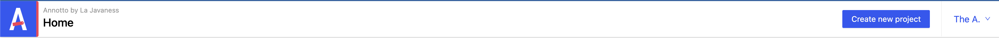
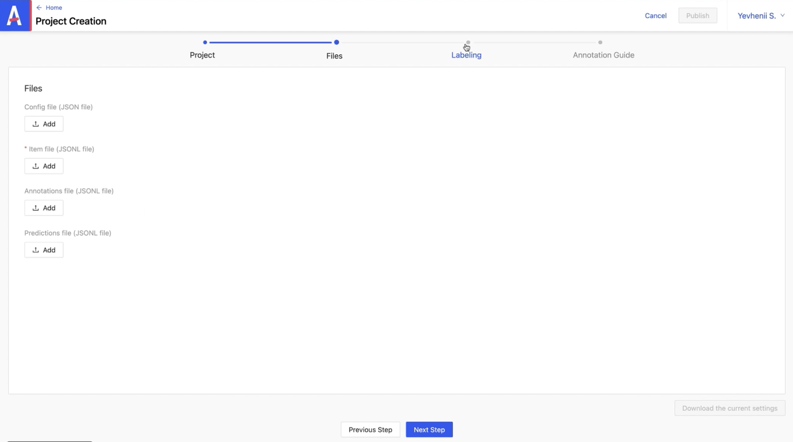
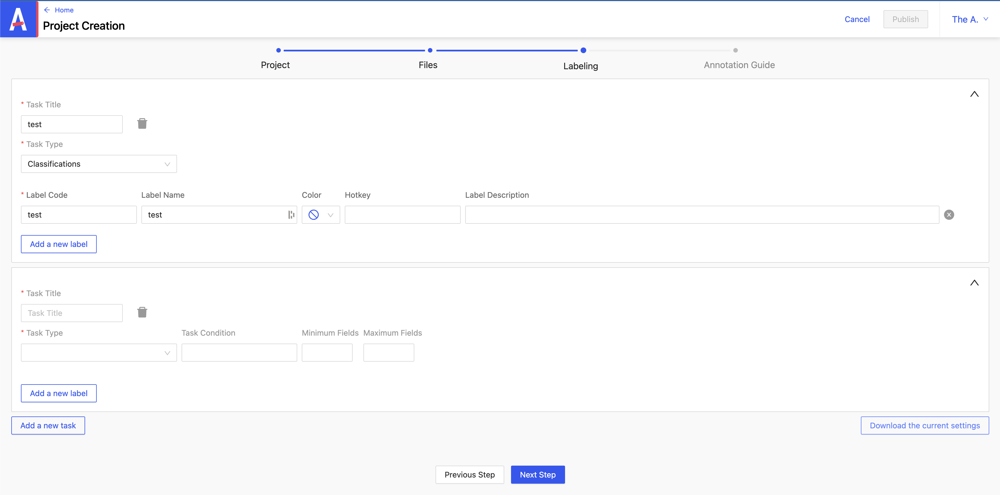

# Creation of a project: NER and classification

From the header, click on **_Create new project_**.



### 1/ Project tab

Fill in the required fields:

- **_Customer_**
- **_Project type_**
- **_Project name_**
- **_Project deadline_**
- **_Project description_**

Non-mandatory fields:

- **_Default markers_**: appears on the item later
- **_to delete_**: indicates an item to delete
- **_to check_**: indicates an item to check
- **_to discuss_**: indicates an item to discuss

You can define access levels for the imported item :

- **_the admin_**
- **_the data scientist_**
- **_the user_**


### 2/ Files tab


the fields :

- **_Config file_**: config file
- **_Annotations file_**: file containing the annotations linked to the item
- **_Predictions file_**: file containing the predictions linked to the item

Unlike annotations, predictions come from a pre-trained model. After the import, we can choose whether to keep them or not.

As for the mandatory field:

- **_item file_**: this is a list that must be prepared in advance including the type of item and a unique id

### 3/ Labeling tab

You can define what you want to do with the project.

- **_Task Title_**: defines the name
- **_Task Type_**: defines the type



You can add a new label by clicking on **_Add a new label_**.

The fields :

- **_Label Code_**: must be unique
- **_Label Name_**: does not necessarily have to have the same name as Label Code
- **_Color_**: defines the color of the label
- **_Hotkey_**: allows you to create a keyboard shortcut
- **_Label Description_**: describes the label


:::caution
Once these labels have been defined, it is no longer possible to modify them later.
:::

### 4/ Annotation Guide tab

Here you can define annotation rules.

Once the specifications of a project have been filled in, you can click on **_Add a new task_** to start filling in the details of another project.



_ex config.json_

```json
{
  "tasks": [],
  "name": "DEMO: NER and Classification text",
  "client": "LJN",
  "type": "text",
  "highlights": [],
  "description": "Demo NER and Classification",
  "admins": ["admin@test.com"],
  "users": ["user@test.com"],
  "dataScientists": ["data@test.com"],
  "defaultTags": [],
  "showPredictions": true,
  "prefillPredictions": true,
  "filterPredictionsMinimum": 0.4,
  "deadline": "2023-04-30T13:57:20.355Z",
  "entitiesRelationsGroup": []
}
```

_ex items.jsonlines_

```json
{"predictions":{"raw":{"Sentiment":{"labels":[{"value":"pos","proba":0.999}]},"Entities 1":{"entities":[{"value":"name","start":23,"end":33}]}},"keys":[{"value":"pos","proba":0.999},{"value":"name","start":23,"end":33}]},"uuid":"76030ac8-6d2d-40ab-a497-4aa6a1404446","data":{"text":"Bonjour, je souhaite pouvoir changer mes heures creuse heure pleine"},"type":"text","metadata":{},"description":"","annotated":true,"annotatedBy":["userProfile-42@lajavaness.com"],"createdAt":1658755620546,"velocity":102,"lastAnnotator":{"email":"userProfile-42@lajavaness.com"},"annotatedAt":"2020-11-16T14:17:09.627Z","seenAt":"2022-11-18T09:15:06.634Z"}
{"predictions":{},"uuid":"41ee6af9-078f-4ad9-8bec-6fe1b8871c08","data":{"text":"Je suis en discussion en ce moment avec @E ..."},"type":"text","metadata":{},"description":"","annotated":false,"createdAt":1658755620546,"velocity":null,"lastAnnotator":{},"seenAt":"2022-11-21T07:31:08.874Z"}
{"predictions":{},"uuid":"e0870093-180d-46ac-9dd8-2e4b9661025f","data":{"text":"Bonjour j'aimerai demander des informations concernant une regularisation suite à un changement de compteur"},"type":"text","metadata":{},"description":"","annotated":true,"annotatedBy":["userProfile-42@lajavaness.com"],"createdAt":1658755620546,"velocity":19,"lastAnnotator":{"email":"userProfile-42@lajavaness.com"},"annotatedAt":"2020-11-16T14:15:27.927Z","seenAt":"2022-11-21T07:31:06.480Z"}
{"predictions":{},"uuid":"7caffcc4-ee3d-41ce-9d7e-32fe7c99b064","data":{"text":"Bonjour @E maintenant que je dispose d'un beau compteur communiquant, pouvez-vous m'indiquer les démarches à suivres pour consulter ma consommation en \"direct\" ?"},"type":"text","metadata":{},"description":"","annotated":true,"annotatedBy":["userProfile-42@lajavaness.com"],"createdAt":1658755620546,"velocity":123,"lastAnnotator":{"email":"userProfile-42@lajavaness.com"},"annotatedAt":"2020-11-16T14:15:08.057Z","seenAt":"2022-11-21T07:31:03.042Z"}
```
