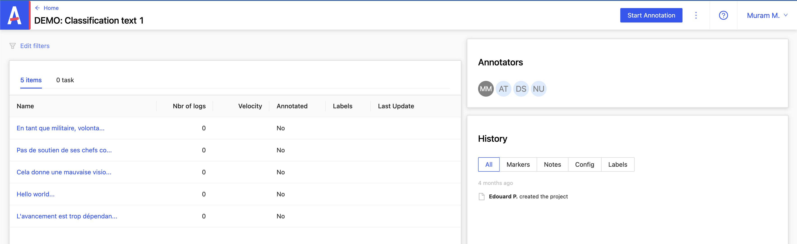
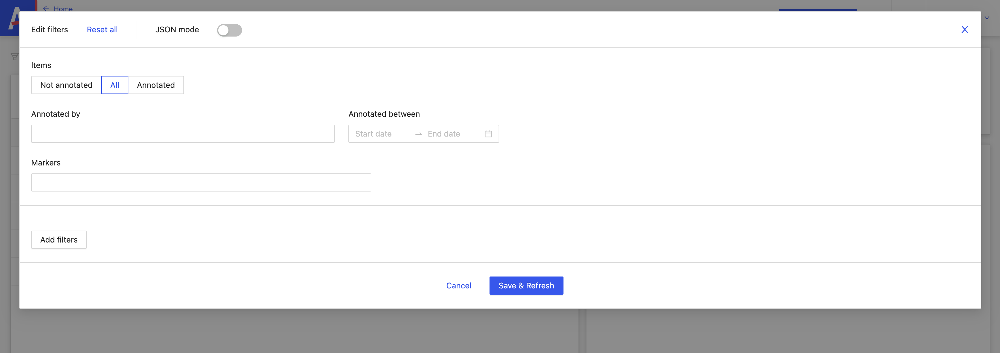
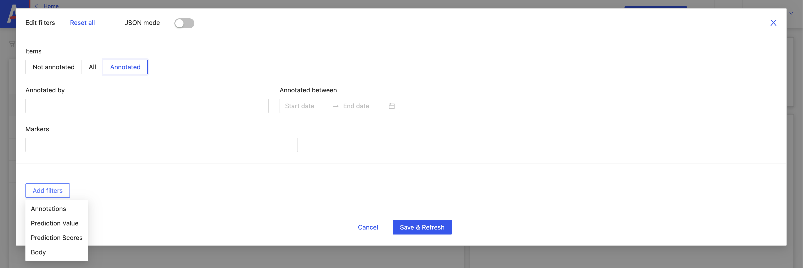

# Filtrer

Depuis la page du projet sélectionné, je clique sur **_Edit Filters_**.

Un modal s’ouvre à partir duquel je peux filtrer par :

- **Items**

- **Not annotated** : non annoté

- **All** : tous les items

- **Annotated** : items annoté

- **Annotated by** : annoté par

- **Annotated between** : date

- **Markers**

Je peux également choisir depuis un dropdown, d’ajouter d’autres filtres.

:::info
sur les projets de types images, il n’y a pas de filtre **_Body_**
:::
