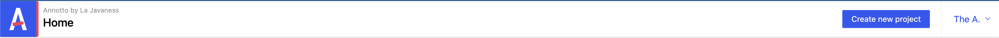
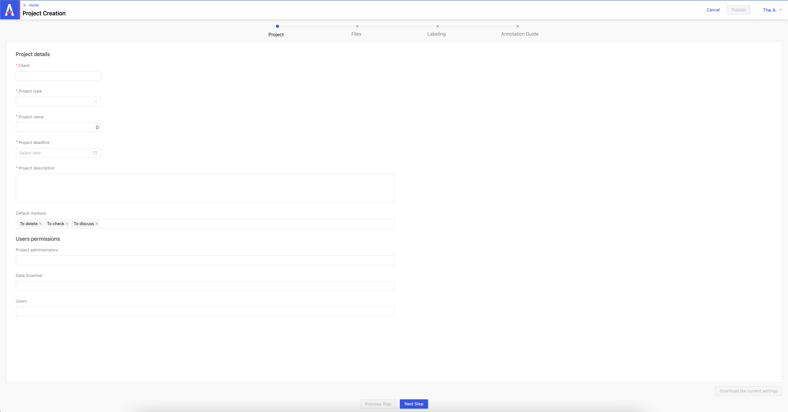
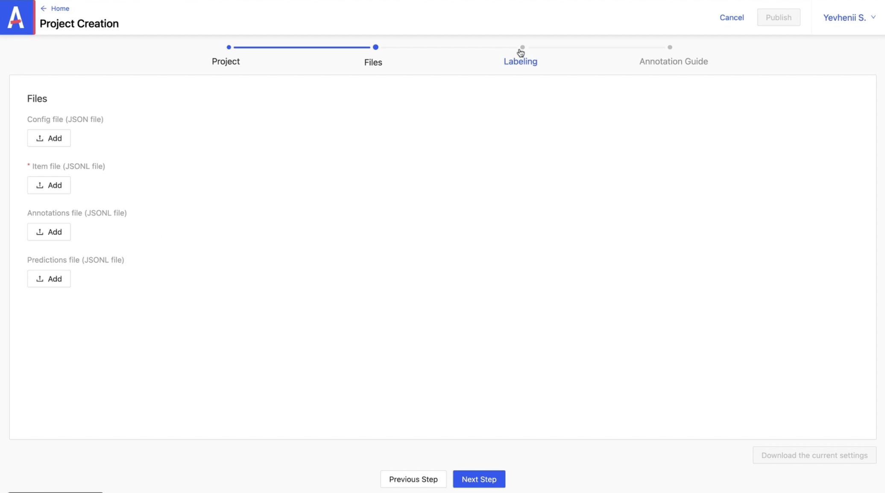
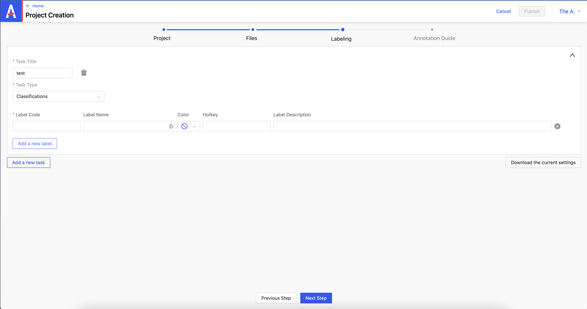
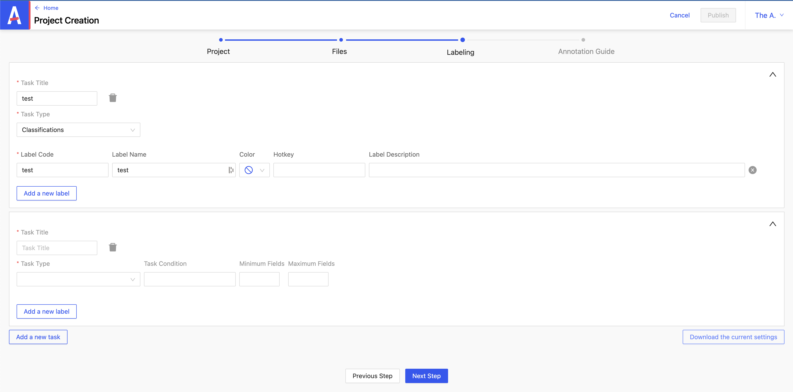

# Creation of a project: NER with relation

From the header, click on **_Create new project_**.



### 1/ Project tab

Fill in the required fields:

- **_Customer_**
- **_Project type_**
- **_Project name_**
- **_Project deadline_**
- **_Project description_**

Non-mandatory fields:

- **_Default markers_**: appears on the item later
- **_to delete_**: indicates an item to delete
- **_to check_**: indicates an item to check
- **_to discuss_**: indicates an item to discuss

You can define access levels for the imported item :

- **_the admin_**
- **_the data scientist_**
- **_the user_**



### 2/ Files tab


the fields :

- **_Config file_**: config file
- **_Annotations file_**: file containing the annotations linked to the item
- **_Predictions file_**: file containing the predictions linked to the item

Unlike annotations, predictions come from a pre-trained model. After the import, we can choose whether to keep them or not.

As for the mandatory field:

- **_item file_**: this is a list that must be prepared in advance including the type of item and a unique id

### 3/ Labeling tab

You can define what you want to do with the project.

- **_Task Title_**: defines the name
- **_Task Type_**: defines the type



You can add a new label by clicking on **_Add a new label_**.

The fields :

- **_Label Code_**: must be unique
- **_Label Name_**: does not necessarily have to have the same name as Label Code
- **_Color_**: defines the color of the label
- **_Hotkey_**: allows you to create a keyboard shortcut
- **_Label Description_**: describes the label



:::caution
Once these labels have been defined, it is no longer possible to modify them later.
:::

### 4/ Annotation Guide tab

Here you can define annotation rules.

Once the specifications of a project have been filled in, you can click on **_Add a new task_** to start filling in the details of another project.



_ex config.json_

```json
{
  "tasks": [],
  "name": "DEMO: NER with relations",
  "client": "LJN",
  "type": "text",
  "highlights": [],
  "description": "Projet de demo",
  "admins": ["admin@test.com"],
  "users": ["user@test.com"],
  "dataScientists": ["data@test.com"],
  "defaultTags": [],
  "showPredictions": true,
  "prefillPredictions": true,
  "filterPredictionsMinimum": 0.4,
  "deadline": "2023-11-30T13:57:20.355Z",
  "entitiesRelationsGroup": [
    {
      "_id": "62de9a245902f5001ce49c77",
      "name": "relationsGroup1",
      "min": 2,
      "max": 2,
      "values": [
        {
          "exposed": true,
          "_id": "62de9a245902f5001ce49c78",
          "value": "is_from",
          "label": "is_from"
        },
        {
          "exposed": true,
          "_id": "62de9a245902f5001ce49c79",
          "value": "belongs_to",
          "label": "belongs_to"
        }
      ]
    },
    {
      "_id": "62de9a245902f5001ce49c7a",
      "name": "relationsGroup2",
      "values": [
        {
          "exposed": true,
          "_id": "62de9a245902f5001ce49c7b",
          "value": "is_unit",
          "label": "is_unit"
        }
      ]
    }
  ]
}
```

_ex items.jsonlines_

```json
{
  "predictions": {
    "raw": { "Entities": { "entities": [{ "value": "name", "start": 23, "end": 33 }] } },
    "keys": [{ "value": "name", "start": 23, "end": 33 }]
  },
  "uuid": "1831440",
  "data": { "text": "En tant que militaire, volontaire sous contrat" },
  "type": "text",
  "metadata": {},
  "description": "",
  "annotated": false,
  "createdAt": 1658755620660,
  "velocity": null,
  "lastAnnotator": {},
  "seenAt": "2022-11-02T11:59:42.501Z"
}
```
