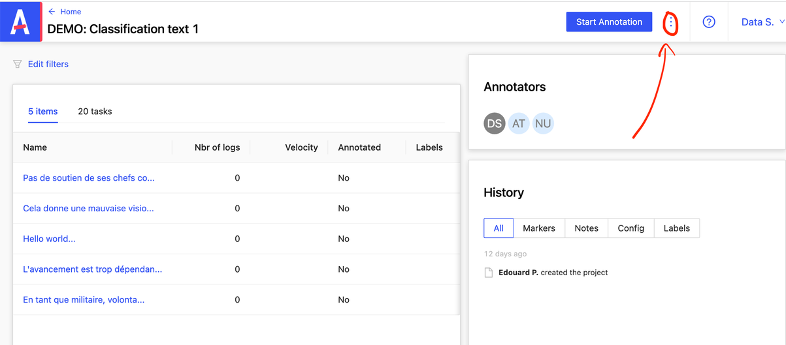
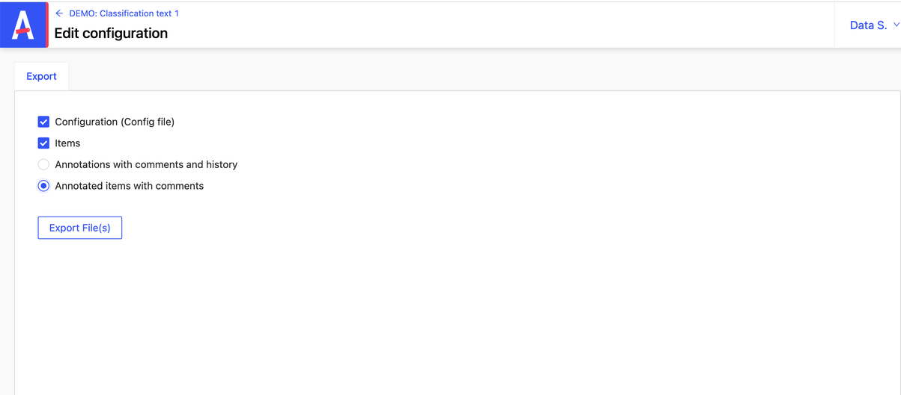

# Export des données

Ce document explique comment la procédure d’export des données via l’APi et via le front d’Annotto

## Via l'API :

```shell
GET "{{url}}:{{port}}/api/projects/{{projectId}}/exports"
```

## Via le front :

Ci-dessous, la description étape par étape de la procédure d’export des données.

Après vous être connectés :

- Cliquez sur l’un de vos projets.
- Cliquez sur les 3 petits points à droite de “ Start Annotation “



- Cliquez sur “ Export “
- Selectionnez ce que vous souhaitez exporter :



Le fichier de configuration et/ou le fichier d’items. Avec ou sans commentaires et historiques

- Enfin, cliquez sur “Export File(s)”
