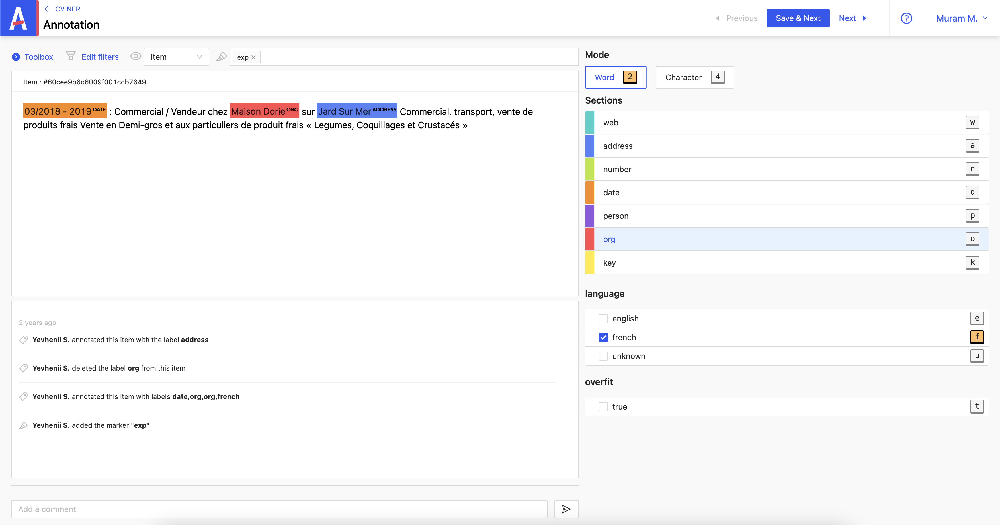

import useBaseUrl from '@docusaurus/useBaseUrl'

# Annotation d'un projet type : NER et Classification

En cliquant sur le projet **DEMO : NER and Classification**, vous avez la possibilité de classer l’item dans certaines catégories. À travers le NER qui comprend deux modes de sélections **_Word_** et **_Character_** et la Classification avec laquelle la sélection se fait à travers un checkbox.

Le mode **_Word_** permet de sélectionner un mot ou bien une suite de mots.

Dans l’exemple ci-dessous, on détermine la date le nom de l’organisation et l’adresse.

<video src={useBaseUrl('/video/screenrecord-1-7.mov')} controls width="100%"></video>

Une fois l’annotation terminée, on sauvegarde en cliquant sur **_Save & Next_**.

Pour supprimer une annotation, il suffit de cliquer sur la croix qui encadre la sélection.

Le mode **_Character_** permet de sélectionner un caractère ou bien des caractères.

Dans l’exemple ci-dessous, on détermine le mois.

<video src={useBaseUrl('/video/screenrecord-1-8.mov')} controls width="100%"></video>

Une fois l’annotation terminée, on sauvegarde en cliquant sur **_Save & Next_**.

Pour supprimer une annotation, il suffit de cliquer sur la croix qui encadre la sélection.

En plus du NER, la Classification permet ici de déterminer la langue du document. Par exemple, sur l’enregistrement ci-dessous, l’utilisateur a estimer en lisant le message que la langue utilisée est le français.

Pour supprimer cette annotation, il suffit de décocher la case.
