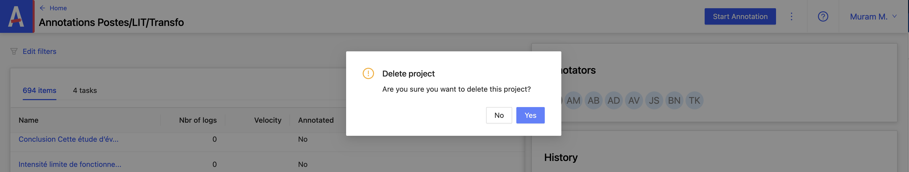

# Supprimer un projet

Depuis la page du projet :

1. Je clique sur **_options_**

2. puis sur **_Delete Project_**

Un modal s’ouvre me demandant confirmation de cette action

Je clique sur **_Yes_**

Le projet est bien supprimé.
