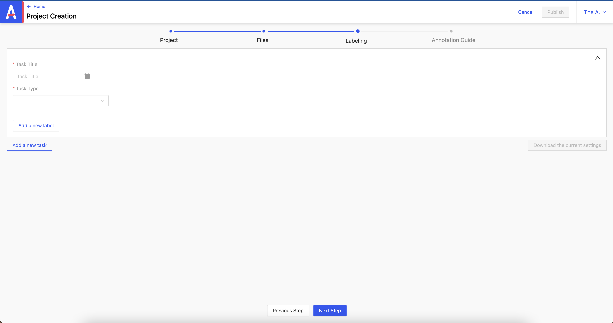
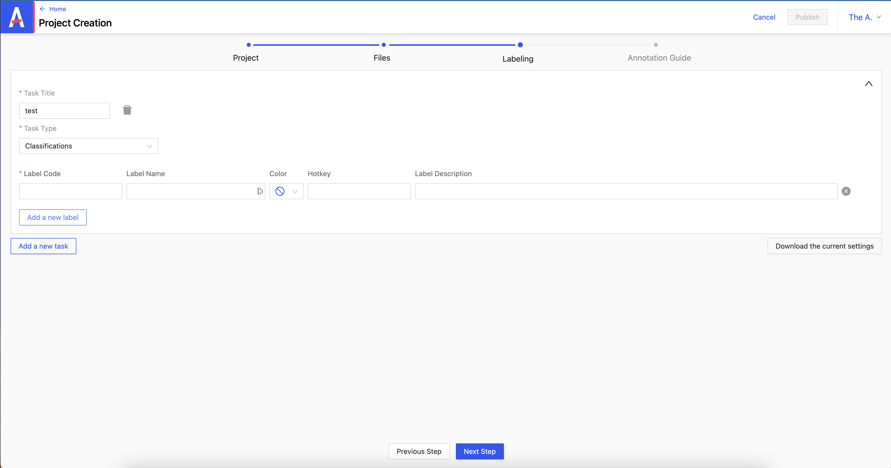

# Création d'un projet type : NER with relation

Depuis le header, je clique sur **_Create new project_**.


### 1/ Étape Project

On renseigne les champs obligatoires :

- **_Client_**
- **_Project type_**
- **_Project name_**
- **_Project deadline_**
- **_Project description_**

Les champs non obligatoires :

- **_Default markers_** : apparaît sur l’item plus tard
- **_to delete_** : indique un item à supprimer
- **_to check_** : indique un item à vérifier
- **_to discuss_**: indique un item à discuter

On peut définir des niveaux d’accès à l’item importé à :

- **_l’admin_**
- **_le data scientist_**
- **_l’utilisateur_**


### 2/ Étape Files



les champs :

- **_Config file_**: fichier de config
- **_Annotations file_**: fichier contenant les annotations liées à l’item
- **_Predictions file_**: fichier contenant les predictions liées à l’item

Contrairement aux annotations, les prédictions viennent d’un modèle pré-entraîné. Après l’import, on pourra choisir de les garder ou non.

Quant au champ obligatoire :

- **_item file_** : c’est une liste qu’il faut préparer à l’avance comprenant le type de l’item et une id unique

### 3/ Étape Labeling

On va définir ce qu’on veut faire avec notre projet.

- **_Task Title_** : définit le nom
- **_Task Type_** : définit le type


On peut ajouter un nouveau label en cliquant sur **_Add a new label_**.

Les champs :

- **_Label Code_** : doit être unique
- **_Label Name_** : ne doit pas forcement porter le même nom que Label Code
- **_Color_** : définit la couleur du label
- **_Hotkey_** : permet de créer un raccourci clavier
- **_Label Description_** : une description du label



:::caution
Une fois ces labels définis, il n’est plus possible de les modifiers par la suite.
:::

### 4/ Étape Annotation Guide

On peut ici définir des règles d’annotations.

Une fois les spécifications d’un projet renseignées, on peut cliquer sur **_Add a new task_** pour commencer à renseigner les détails d'un autre projet.


_exemple d'un fichier de config_

```json
{
  "tasks": [],
  "name": "DEMO: NER with relations",
  "client": "LJN",
  "type": "text",
  "highlights": [],
  "description": "Projet de demo",
  "admins": ["admin@test.com"],
  "users": ["user@test.com"],
  "dataScientists": ["data@test.com"],
  "defaultTags": [],
  "showPredictions": true,
  "prefillPredictions": true,
  "filterPredictionsMinimum": 0.4,
  "deadline": "2023-11-30T13:57:20.355Z",
  "entitiesRelationsGroup": [
    {
      "_id": "62de9a245902f5001ce49c77",
      "name": "relationsGroup1",
      "min": 2,
      "max": 2,
      "values": [
        {
          "exposed": true,
          "_id": "62de9a245902f5001ce49c78",
          "value": "is_from",
          "label": "is_from"
        },
        {
          "exposed": true,
          "_id": "62de9a245902f5001ce49c79",
          "value": "belongs_to",
          "label": "belongs_to"
        }
      ]
    },
    {
      "_id": "62de9a245902f5001ce49c7a",
      "name": "relationsGroup2",
      "values": [
        {
          "exposed": true,
          "_id": "62de9a245902f5001ce49c7b",
          "value": "is_unit",
          "label": "is_unit"
        }
      ]
    }
  ]
}
```

_exemple d'un fichier d'items_

```json
{
  "predictions": {
    "raw": { "Entities": { "entities": [{ "value": "name", "start": 23, "end": 33 }] } },
    "keys": [{ "value": "name", "start": 23, "end": 33 }]
  },
  "uuid": "1831440",
  "data": { "text": "En tant que militaire, volontaire sous contrat" },
  "type": "text",
  "metadata": {},
  "description": "",
  "annotated": false,
  "createdAt": 1658755620660,
  "velocity": null,
  "lastAnnotator": {},
  "seenAt": "2022-11-02T11:59:42.501Z"
}
```
